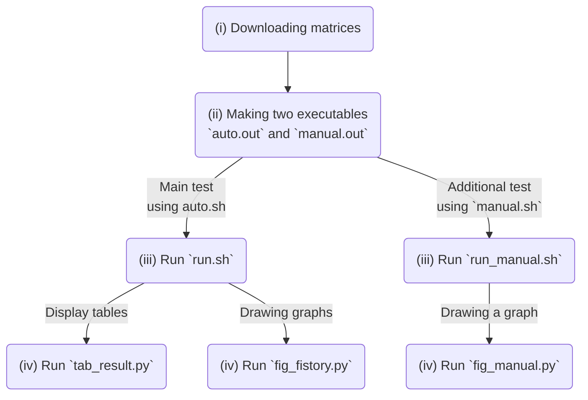

# Artifact Description

## Artifact Identification

### Abstract of the article

Our article proposed integer arithmetic-based implementations of the algebraic multigrid (AMG) method and the preconditioned FGMRES method with iterative refinement for solving a linear system. Combining the two integer arithmetic-based implementations, we developed an integer arithmetic-based linear solver (int-AMG-FGMRES($m$)). Then, through numerical experiments, we compared it with two floating-point arithmetic-based AMG preconditioned FGMRES solvers: one based on only FP64 arithmetic (FP64-AMG-FGMRES($m$)) and one based on a mixed-precision algorithm of FP32 and FP64 arithmetic (FP32-AMG-FGMRES($m$)). The numerical results showed that our integer-based solver had a comparable convergence rate to the two floating-point-based solvers. Additionally, the results demonstrated that our solver had a similar timing performance to the mixed-precision solver and ran faster than the FP64-based solver.

### Role of the CA

Our computational artifact (CA) provides the implementations of all three solvers and the test suites with scripts. Because the CA is self-contained, it can reproduce the experiments of the article by itself, except for the effect of the compiler implementation and the execution environment. The CA comprises three directories: [Library](Library), [Work](Work), and [Matrix](Matrix). The Library directory includes our C++ header-only library for implementing the three solvers. The Work directory contains the C++ main file and the Zsh and Python scripts for the test suites and drawing figures. The Matrix directory stores the datasets used in the tests.

## Reproducibility of Experiments

### Experiment workflow

The workflow of the experiment reproduction consists of four steps. (i) First, if necessary, the test matrices are downloaded from the SuiteSparse Matrix Collection because we do not contain them in the CA due to the file size. (ii) Next, the C++ source code is compiled using GNU Make. Note that we assume the use of GCC or Intel oneAPI. (iii) Then, the Zsh scripts perform all tests using the executables. (iv) Finally, the Python scripts draw the graphs of the convergence history. Each step will take about 3, 1, 15, or 1 minute, respectively. Thus the total execution time will be about 20 minutes.

### About expected results

In step (ii), GNU Make generates two executable files. One performs the main experiments for comparing the three solvers, and the other achieves the additional test for evaluating the effect of the fractional bit length of fixed-point formats on our integer-based solver.

In step (iii), the Zsh scripts run the two executables and write the results in text files in a directory of the same name as the test matrices. For example, the results of the `wang3` test are stored in the files in `Work/Result/wang3`. Each file contains the convergence history, the implicit relative residual norm, the execution time, the number of iterations, and the explicit relative residual norm, in that order. The pair of the execution time and the number of iterations corresponds to an entry of the tables in the article. If the executables and scripts perform correctly, the number of iterations should be several dozen, and the execution time should be a few seconds.

The convergence histories correspond to the graphs in the article. In step (iv), similar figures can be reproduced using the Python scripts in the CA.

## Overview of the workflow for the experiments

The overview of the experiment workflow is as shown in the flowchart below.

### (i) Downloading test matrices

First of all, the CA does not contain any of the test matrices due to the file size. Thus, they must be downloaded from [the SuiteSparse Collection Matrix](https://suitesparse-collection-website.herokuapp.com), a matrix database, and put into the [Matrix](Matrix) directory. We provide a Zsh script for downloading all matrices in the directory. You can use it if necessary.

### (ii) Making executables

We use GNU Make to compile our C++ source code. Once the command `make -f (path to the Makefile)` is typed, two executables, `auto.out` and `manual.out`, can be generated.

While `auto.out` is used to compare the performance of the three solvers, `manual.out` is used to evaluate the effect of the fractional bit length on the int-AMG-FMGRES($m$) solver. For more information, see the README file in the [Work](Work) directory.

### (iii) Running executables

In the Work directory, we provide two Zsh scripts including all test cases. Thus, only running the two scripts, all results will be generated.

### (iv) Drawing graphs

In the [Work/Artwork](Work/Artwork) directory, one can reproduce similar tables and graphs based on the obtained results, using the Python scrips.
