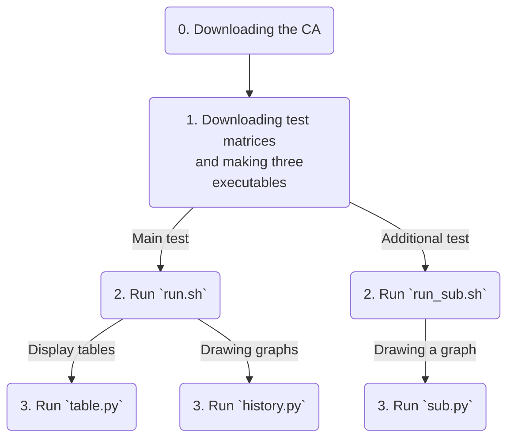

# Artifact Description Appendix

## Artifact Identification

### Abstract of the article

We proposed integer arithmetic-based implementations of the algebraic multigrid (AMG) method and the preconditioned FGMRES method with iterative refinement for solving a linear system. Combining the two integer arithmetic-based implementations, we developed an integer arithmetic-based linear solver (int-AMG-FGMRES($m$)). Then, through numerical experiments, we compared it with two floating-point arithmetic-based AMG preconditioned FGMRES solvers: one based on only FP64 arithmetic (FP64-AMG-FGMRES($m$)) and one based on a mixed-precision algorithm of FP32 and FP64 arithmetic (FP32-AMG-FGMRES($m$)). The numerical results showed that our integer-based solver had a comparable convergence rate to the two floating-point-based solvers. Additionally, the results demonstrated that our solver had a similar timing performance to the mixed-precision solver and ran faster than the FP64-based solver.

### Role of the CA

Our computational artifact (CA) comprises C++ source files for the
solver implementations and some supplemental Zsh and Python scripts,
which provide the test suites and draw graphs. Because the C++ source
code depends on no external libraries, it can reproduce the experiments
of the article by itself, except for the effect of the computing
environment.

Although the CA may work on any modern CPU-based computers, we suggest a
CPU supporting a C++20 compiler for adequate reproducibility considering
the use of the bit-shifting operations. The CA supports matrix files
encoded by the Matrix Market format. All test matrices used in the
article are available from the SuiteSparse Matrix Collection
(https://suitesparse-collection-website.herokuapp.com), which can be downloaded with the script in the CA.

The CA includes three directories: [Matrix](Matrix), [Library](Library), and [Work](work). The Matrix directory stores the test matrices, and the Work directory is used for the experiments below. In the Library directory, the kernels of the three solvers are implemented. For more information, please read the [README.md](README.md) file in the Library directory.

## Reproducibility of Experiments

### Overview of the workflow for the experiments

The experiment workflow consists of three steps: installation, execution, and graph drawing. These steps require about 2, 25, and 3 minutes, respectively; the total execution time will be 30 minutes. The overview of the experiment workflow is as shown in the flowchart below.



### 0. Downloading the CA

The CA can be downloaded with

```shell
git clone https://github.com/suzuki-hpc/SC23-AD.git
```

or as ZIP manually.

### 1. Installation

#### Downloading matrices

The CA does not contain any of the test matrices due to the file size. Thus, they must be downloaded from [the SuiteSparse Collection Matrix](https://suitesparse-collection-website.herokuapp.com) and put into the [Matrix](Matrix) directory. We provide a Zsh script for downloading all matrices in the directory. You can use it if necessary.

```shell
cd <path to the CA>/Matrix
zsh download.sh
```

#### Making executables

We employ GNU Make to compile our C++ source code, which is performed as follows:

```shell
cd <path to the CA>/Work
make -f Makefile
```

Note that `Makefile` assumes the use of Intel OneAPI or GCC. If
necessary, the compiler and the options should be modified. If the
compilation is successful, three executables, `seq.exe`, `multi.exe`,
and `sub.exe`, are created. The first two compare the performance of the
three solvers, while the latter evaluates the effect of the fractional
bit length of fixed-point formats on our int-AMG-FMGRES($m$) solver.

For more information, see the README file in the [Work](Work) directory.

### 2. Execution

Next, all tests performed using the executables. The executables can be
individually executed as follows:

```shell
./seq.exe <test name> 0 <solver> <m>
./multi.exe <test name> 1 <solver> <m>
./sub.exe <test name> 0 <m> <bit>
```

`<solver>` is set to 0, 1, or 2 and specifies the solver used. The
numbers indicates FP64, mixed-precision, and integer-based solvers,
respectively. `<m>` is the restart period, and `<bit>` is the manually
assigned fractional bit length. For simplicity, the CA provides two Zsh
scripts perform all test cases in the article:

```shell
zsh run.sh
zsh run_sub.sh
```

`run.sh` performs all tests using `seq.exe` and `multi.exe`. If these
tests are performed successfully, text files having the results are
generated in the `Work/Result/<test name>` directories with the name
including the used parameters. Each file contains the convergence
history, the implicit relative residual norm, the execution time of the
solution process, the number of iterations, and the explicit relative
residual norm, in that order. The pair of the execution time and the
number of iterations corresponds to an entry of the tables in the
article. If the executables properly work, the execution time should be a few seconds to a few dozen seconds, and the number of iterations should be several dozen.

`run_sub.sh` perform the tests using `sub.exe`. The results of the tests are written to a file in the `Work/Result/<test name>_sub` directories. All texts contain the same items to the ones of the former tests.

### 3. Drawing graphs

Finally, the tables and graphs in the article are reproduced by the
Python scripts as follows:

```shell
cd <path to the CA>/Work/Artwork
pip3 install -r requirements.txt
python3 table.py <type>
python3 hist.py <test name> <m> <type>
python3 sub.py
```

These Python scripts depends on `Matplotlib` and `python-tabulate`,
which are installed with the second command from the top. `tabel.py`
displays similar tables to the ones in the article. `<type>` specify
whether the solvers implemented sequentially or multi-threaded and must
be `seq` or `multi`. `history.py` generates graphs of the convergence
history. `<m>` denotes the restart period and must be 5, 10, or 20.
`<type>` is set to `seq` or `multi`. `sub.py` creates a graph evaluating
the effect of the fractional bit length.

The three steps will take about 2, 25, or 3 minutes, respectively; the
total execution time will be about 30 minutes. For more information,
please visit the GitHub page.
