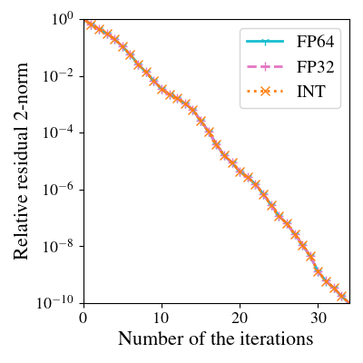

# Creating artworks

## Setting-up

In this CA, all tables and figures similar to the ones in the articles are created by three python scripts: `table.py`, `hist.py`, and  `sub.py`. These scripts depend on external libraries, and thus those must be installed first. Since, we have compiled all the necessary library information in `requirements.txt`, you can install them with the following command.

```shell
pip install -r requirements.txt
```

## Drawing the tables

```shell
cd <path to the CA>/Work/Artwork
python table.py <seq or multi>
```

The `table.py` script display a table using the text files in the `Result` directory. If `seq` is passed as the runtime, the table having the results of the sequential solvers will be displayed. On the other hand, if `multi` is passed, the results of the multi-threaded solvers will be showed on standard output. An example of the output is as follows, where only the three tests for `atmosmdd`, `wang3`, and `wang4` were performed.

```
m = 5
                       FP64              FP32               INT
Matrix         Time    Itr.      Time    Itr.      Time    Itr.
---------  --------  ------  --------  ------  --------  ------
atmosmodd  2.43e+00      27  1.71e+00      27  1.92e+00      27
wang3      1.85e-01      45  1.03e-01      45  1.18e-01      45
wang4

m = 10
                       FP64              FP32               INT
Matrix         Time    Itr.      Time    Itr.      Time    Itr.
---------  --------  ------  --------  ------  --------  ------
atmosmodd  2.49e+00      27  1.73e+00      27  1.93e+00      27
wang3      1.06e-01      24  6.29e-02      25  6.99e-02      25
wang4      5.43e-01     113  3.02e-01     113  3.57e-01     118

m = 20
                       FP64              FP32               INT
Matrix         Time    Itr.      Time    Itr.      Time    Itr.
---------  --------  ------  --------  ------  --------  ------
atmosmodd  2.30e+00      24  2.83e+00      43  2.35e+00      32
wang3      8.37e-02      18  8.46e-02      32  9.60e-02      32
wang4      4.77e-01      94  2.71e-01      93  3.31e-01     101
```

## Drawing the figures

### Convergence history

```shell
cd (path to this directory)
python hist.py <test name> <m> <seq or multi>
```

The following figure is an example when `python hist.py atmosmodd 5 seq` is executed on our computer.



### Comparison between different fractional bit lengths

```shell
cd (path to this directory)
python sub.py 
```


